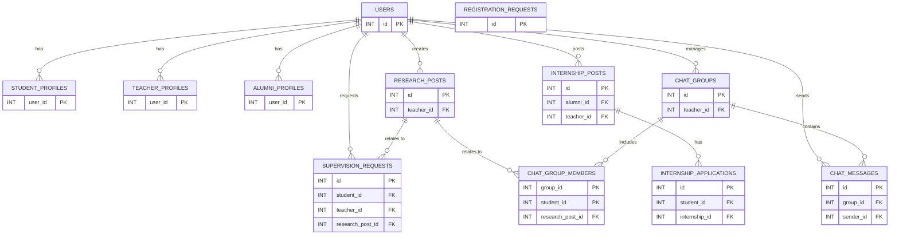

erDiagram

    USERS {
        INT id PK
        VARCHAR aiub_id UNIQUE
        VARCHAR name
        VARCHAR email UNIQUE
        ENUM role
        VARCHAR password_hash
        VARCHAR status
        TINYINT is_active
        TIMESTAMP created_at
    }

    REGISTRATION_REQUESTS {
        INT id PK
        ENUM role
        VARCHAR name
        VARCHAR aiub_id UNIQUE
        VARCHAR email UNIQUE
        VARCHAR password_hash
        VARCHAR department
        VARCHAR major
        DECIMAL cgpa
        INT credits_completed
        VARCHAR linkedin_url
        VARCHAR researchgate_url
        VARCHAR status
        VARCHAR admin_note
        TIMESTAMP created_at
        TIMESTAMP decided_at
    }

    STUDENT_PROFILES {
        INT user_id PK FK
        VARCHAR department
        VARCHAR major
        DECIMAL cgpa
        INT credits_completed
        VARCHAR linkedin_url
        VARCHAR researchgate_url
        VARCHAR cv_path
        VARCHAR proposal_path
        TIMESTAMP created_at
        TIMESTAMP updated_at
    }

    TEACHER_PROFILES {
        INT user_id PK FK
        VARCHAR department
        VARCHAR linkedin_url
        VARCHAR researchgate_url
        TIMESTAMP created_at
        TIMESTAMP updated_at
    }

    ALUMNI_PROFILES {
        INT user_id PK FK
        VARCHAR department
        VARCHAR linkedin_url
        VARCHAR researchgate_url
        TIMESTAMP created_at
        TIMESTAMP updated_at
    }

    RESEARCH_POSTS {
        INT id PK
        INT teacher_id FK
        VARCHAR title
        VARCHAR domain
        TEXT description
        TIMESTAMP created_at
        TINYINT is_active
    }

    SUPERVISION_REQUESTS {
        INT id PK
        INT student_id FK
        INT teacher_id FK
        INT research_post_id FK
        VARCHAR status
        VARCHAR cv_path
        VARCHAR proposal_path
        VARCHAR teacher_comment
        TIMESTAMP created_at
    }

    INTERNSHIP_POSTS {
        INT id PK
        INT alumni_id FK
        INT teacher_id FK
        VARCHAR title
        VARCHAR company
        TEXT requirements
        DATE deadline
        VARCHAR circular_path
        VARCHAR apply_link
        TIMESTAMP created_at
        TINYINT is_active
    }

    INTERNSHIP_APPLICATIONS {
        INT id PK
        INT student_id FK
        INT internship_id FK
        VARCHAR status
        TIMESTAMP created_at
    }

    CHAT_GROUPS {
        INT id PK
        INT teacher_id FK
        VARCHAR group_name
        TIMESTAMP created_at
    }

    CHAT_GROUP_MEMBERS {
        INT group_id PK FK
        INT student_id PK FK
        INT research_post_id FK
        TIMESTAMP created_at
    }

    CHAT_MESSAGES {
        INT id PK
        INT group_id FK
        INT sender_id FK
        VARCHAR sender_role
        TEXT message
        TIMESTAMP created_at
    }

    USERS ||--o{ STUDENT_PROFILES : "has"
    USERS ||--o{ TEACHER_PROFILES : "has"
    USERS ||--o{ ALUMNI_PROFILES : "has"
    USERS ||--o{ RESEARCH_POSTS : "creates"
    USERS ||--o{ SUPERVISION_REQUESTS : "requests"
    USERS ||--o{ INTERNSHIP_POSTS : "posts"
    USERS ||--o{ CHAT_GROUPS : "manages"
    USERS ||--o{ CHAT_MESSAGES : "sends"

    RESEARCH_POSTS ||--o{ SUPERVISION_REQUESTS : "relates to"
    RESEARCH_POSTS ||--o{ CHAT_GROUP_MEMBERS : "relates to"

    INTERNSHIP_POSTS ||--o{ INTERNSHIP_APPLICATIONS : "has"

    CHAT_GROUPS ||--o{ CHAT_GROUP_MEMBERS : "includes"
    CHAT_GROUPS ||--o{ CHAT_MESSAGES : "contains"

